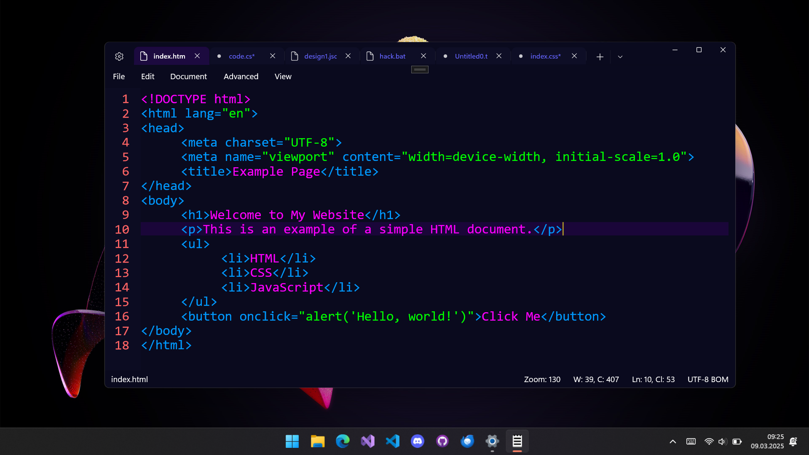
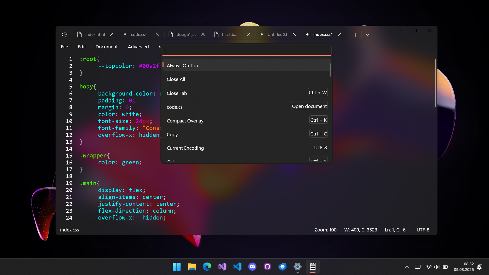
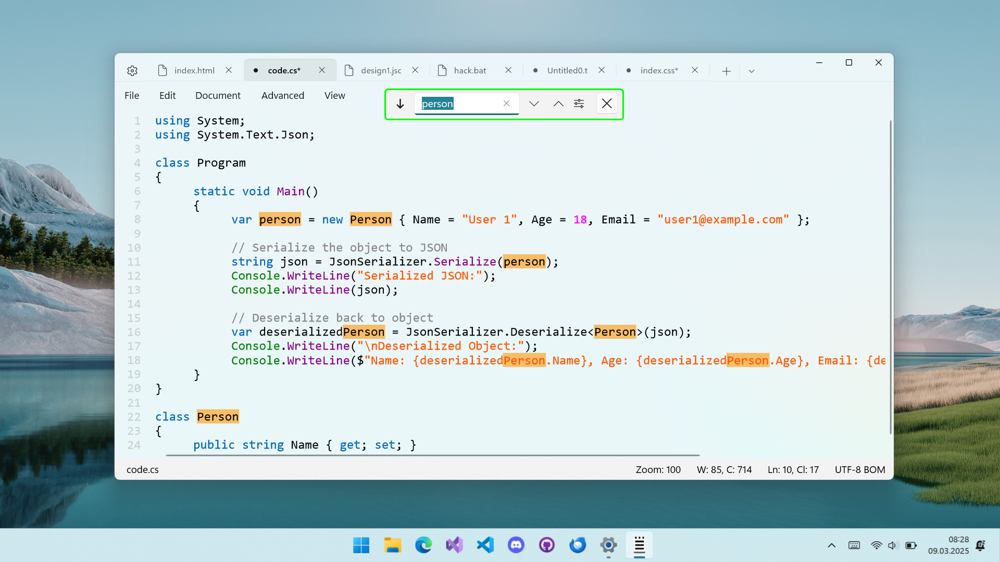

 

    
 

 <h1  align="center">Fastedit</h1>

    
    
    
    

## 🤔 What is Fastedit?
Introducing Fastedit, designed to make editing and organizing your documents effortless. With the ability to open multiple tabs, you can easily edit or view multiple documents at once. The app also features line numbering and custom designs to personalize your experience. A session snapshot feature ensures your work is saved and opens up exactly as you left it. Additionally, the line highlighter and syntax highlighting features make editing code or important information super efficient. Plus, the ability to edit documents in a second instance and a recycle bin to recover deleted files, ensure that you never lose any important work. Upgrade your editing experience with Fastedit.

## Support my work  

## 📥 Download

## 🔍 Features:
- Tabbed Editing – Work with multiple documents at once.
- Customizable Designs – Personalize the editor's appearance.
- Syntax Highlighting – Supports various programming languages.
- Line Numbering – Easily track your code or text.
- Simple Auto Indentation – Maintain clean and structured code.
- Line Highlighter – Quickly locate the active line.
- Powerful Search – Multi-highlight and fast search capabilities.
- Undock Tabs – Edit multiple documents in separate windows.
- Session Snapshot – Restore your previous editing session.
- Recycle Bin – Recover accidentally deleted files.
- Quick Access – All commands in one place for efficiency.
- File Info Dialog – Get detailed insights about opened files.
- Encoding Support – Work with different text encodings.
- Vertical Tab Flyout – Easily navigate between open documents.
- Highly Customizable – Customize to your needs.

## 🚀 Building the project:
To build Fastedit you need Visual Studio and UWP installed. Then you can clone the repository and open the .sln file with Visual Studio.

## 👨‍👩‍👧‍👦 Contributors:
If you want to contribute to this project, feel free to open an <a href="https://github.com/FrozenAssassine/TextControlBox-UWP/issues/new">issue</a> or a <a href="https://github.com/FrozenAssassine/TextControlBox-UWP/pulls">pull request</a>.

## 📸 Images

    
    
    

