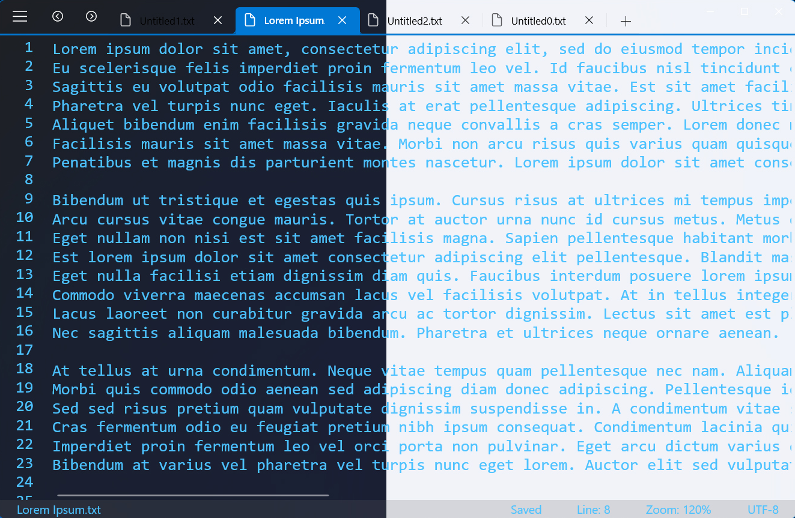
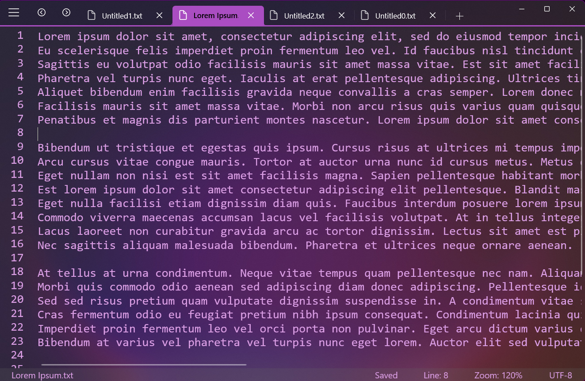
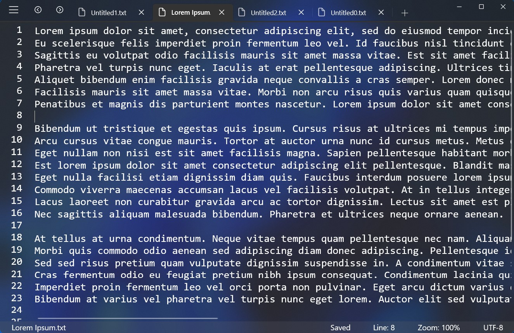

 

    
 

 <h1  align="center">Fastedit</h1>

     
    
    
    
    
 

### What is Fastedit?
Fastedit is a good looking and easy to use Texteditor for Windows. It is made in C# using UWP.
You can edit mutliple documents using tabs, move document into its own instances, access your editing options via a Menubar and/or a Dropdown-menu, customize the design, the way you like it. It saves all your documents everytime your close it and reopens them the way you left it. A linehighlighter and linenumbers are also included

### Features:
- Tabs
- Markdown preview
- Menubar
- Cool designs
- Linenumbering
- Linehighlighter
- Fast search
- Secondary view
- Session snapshot
- Recyclebin
- Open via commandline

#

    
    
    

